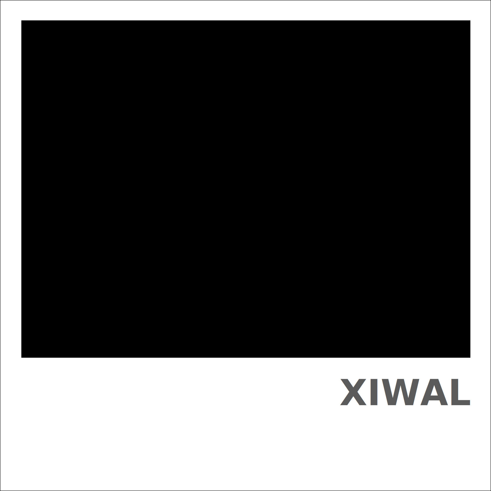

<h3 align="center"></h3>

Generate terminal color schemes.

Xiwal is a tool that generates color schemes from colors. The colors can either
be specified directly or extracted from an image.

It is massivly inspired by [pywal](https://github.com/dylanaraps/pywal), but it
also has some important differences:

-   Xiwal focusses on terminal color schemes. There is no integration with gtk,
    i3, polybar, etc.
-   The colors are reordered to match the traditional "red, green, yellow,
    blue, purple, cyan" structure as close as possible.
-   All generated color schemes use the same CIE Lab lightness levels. They are
    based on my personal experience/taste.
-   Since red and green are important signal colors (e.g. in diffs), their
    saturation is increased.
